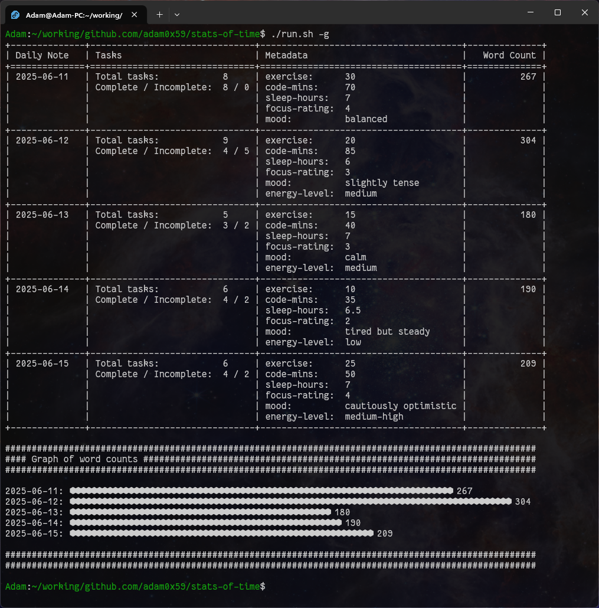

# stats-of-time

**stats-of-time** is a simple Python CLI tool that parses Obsidian daily note Markdown files and extracts stats like task completion, word count, and frontmatter metadata. Perfect for tracking habits, coding time, journaling word counts, or just keeping an eye on your daily activity.

I use Obsidian for my daily notes, I was in need of a first personal project to practice building something from scratch (to escape tutorial hell...). This is something I’ll probably use in its current state. I may extend it in the future, if not, it still helped me learn, which was the main goal.

---

---

## Features

* 📅 **Date-based Sorting** - Uses filenames in `YYYY-MM-DD.md` format for automatic date parsing.
* ✅ **Task Tracking** - Counts top-level tasks and completion status based on Markdown checkboxes.
* 🧠 **Metadata Extraction** - Parses YAML frontmatter for things like sleep, mood, exercise, code time, etc.
* ✍️ **Word Count** - Ignores template content and shows meaningful daily word output.
* 📊 **Terminal Output** - Neat ASCII tables or word count bar graphs right in your terminal.

---

## Installation

1. Clone the repo:

```bash
git clone https://github.com/adam0x59/stats-of-time.git
cd stats-of-time
```

2. (Optional) Set up a virtual environment:

```bash
python -m venv .venv
source .venv/bin/activate  # or .venv\Scripts\activate on Windows
```

3. Install dependencies:

```bash
pip install -r requirements.txt
deactivate # optional, exits the venv
```

---

## Configuration

Edit `CONFIG.py` to set the path to your Obsidian daily notes folder and the word count of your note template:

```python
OBSIDIAN_VAULT_PATH = "./Daily-Notes-Example"  # Path to your notes folder
TEMPLATE_WORD_COUNT = 63  # Number of words to exclude from daily note template
```

---

## File Structure and Parsing

Markdown files must follow the `YYYY-MM-DD.md` naming format — the default for Obsidian daily notes.

* 🔍 **Recursive Search** - The app searches all subdirectories within your notes folder (e.g., an `/archive` folder is included).
* 📁 **Relative Paths** - Files are stored internally by relative path. If duplicate filenames exist in different subfolders, they will appear multiple times in the output.
* 🙈 **Hidden Files Ignored** - Files or folders starting with a dot (e.g., `.git`) are skipped during parsing.

---

## Example Daily Note Format

```markdown
---
exercise: 50
code-mins: 60
sleep-hours: 7
mood: focused
---

- [x] Buy food
- [/] Eat food
  - [x] Lunch
  - [x] Dinner
- [x] Read a chapter of some book
- [ ] Write the readme for stats-of-time
```

---

## Usage

Run the tool using the provided shell script (Script activates the venv on each run, no need to enter manually each time):

```bash
./run.sh
```

This script assumes you've set up a `.venv` folder in the project root. If you're not using that setup, you can run the app manually like this:

```bash
python main.py [options]
```

### Options

```bash
usage: main.py [-h] [-a] [-c COUNT] [-g] [-s] [-G]

Parse and display stats from Obsidian markdown vault

options:
  -h, --help         show this help message and exit
  -a, --all          List all data - Default is most recent 5 rows
  -c, --count COUNT  List data for "COUNT" number of results from the most recent entry back
  -g, --graph        Enable graph mode
  -s, --sort_wc      Sort by word count
  -G, --graph-only   Only display graphs
```

Example:

```bash
./run.sh -c 10 -g
```

---

## Sample Data

If you don't have daily notes handy, the repo includes some example `.md` files generated by an LLM so you can get started right away.

---

## Requirements

* Python 3.8+
* `tabulate`
* `pyyaml` (for parsing YAML metadata)

Install with:

```bash
pip install -r requirements.txt
```

---

## License

MIT License

---

## TODO / Future Features

* 📈 **Metadata Graphing** - Visualize trends in frontmatter data like exercise time or mood.
* 💾 **Local Caching** - Speed up repeated runs by caching parsed data, with an update mechanism.
* 🧠 **Daily Summaries via LLM** - Generate summaries of daily notes using a local or external language model.
* 🔁 **Task Pattern Analysis** - Use LLMs to normalize and cluster task names to identify recurring routines and build personal workflows.

---

Made by [adam0x59](https://github.com/adam0x59)

